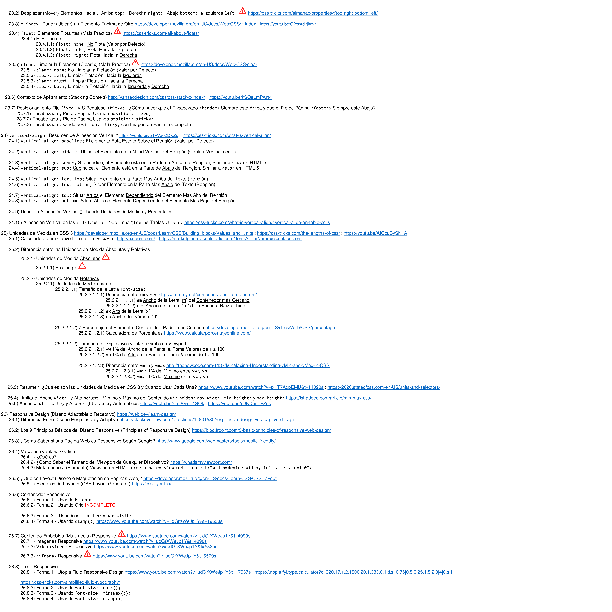

## [Vida MRR - Guía para ser Experto en CSS 3](https://youtu.be/ijWD2eWcwHY?si=Z9Lx6WqQxa5HeENZ) 

------------

# **Aprendiendo CSS 3**

Código de prueba y ejercicios que escribi mientras aprendia CSS 3.

Estos fueron los temas que aprendí:

------------

------------

------------

------------

------------

------------

------------

------------

------------

